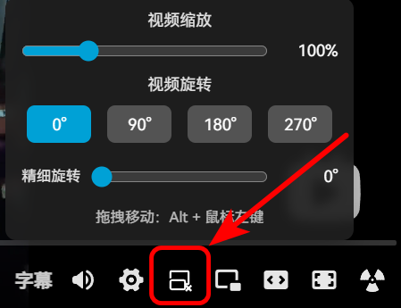

# B站视频缩放旋转脚本

一个用于Bilibili视频的脚本，提供视频缩放、旋转和拖拽移动功能。
代码由AI生成。

## 功能特性

- **视频缩放**：支持 50%-250% 缩放范围，通过滑块精确控制或 `Alt + 滚轮` 快速缩放
- **视频旋转**：支持 0-359 度旋转，提供 0°/90°/180°/270° 快捷按钮和精细滑块
- **拖拽移动**：按住 `Alt键 + 鼠标左键` 可拖拽移动视频位置
- **还原屏幕**：当视频被缩放、旋转或移动时，播放器中央显示还原按钮，一键恢复默认状态
- **快捷键更改**：可在`shortcutConfig`中更改快捷键

## 安装方法

先安装浏览器扩展：[Tampermonkey](https://www.tampermonkey.net/) 或 [Violentmonkey](https://violentmonkey.github.io/)

#### 方式一：从 GreasyFork 一键安装

1. 在浏览器中打开链接：[B站视频缩放、旋转](https://greasyfork.org/zh-CN/scripts/573748-b%E7%AB%99%E8%A7%86%E9%A2%91%E7%BC%A9%E6%94%BE-%E6%97%8B%E8%BD%AC)
2. 点击页面上的 **“安装此脚本”** 绿色按钮。
3. 脚本管理器会弹出新窗口，点击 **“安装”** 即可。

#### 方式二：手动复制脚本内容安装

1. 在 [bilibili-zoom-rotate.js](https://github.com/kqint/bilibili-zoom-rotate/blob/main/bilibili-zoom-rotate.js) 中复制完整代码
2. 点击浏览器右上角的脚本管理器图标（Tampermonkey 或 Violentmonkey）。
3. 选择 **“添加新脚本”**（或“新建用户脚本”）。
4. 删除编辑器中默认的所有代码，**完整粘贴** 刚刚的代码。
5. 按 `Ctrl+S` (Windows/Linux) 或 `Cmd+S` (Mac) 保存。
6. 保存后，脚本即会生效。您刷新 B 站视频页面即可测试。

## 使用方法

### 控制面板

将鼠标悬停在播放器右下角控制栏的"视频工具"图标上，即可显示控制面板：

- **缩放滑块**：拖动调整视频大小（50%-250%）
- **旋转按钮**：点击0°/90°/180°/270°快速旋转
- **精细旋转滑块**：拖动进行任意角度旋转（0-359°）

### 拖拽移动

- 按住 **Alt键** + 鼠标左键，可在视频区域内拖拽移动视频
- 拖拽结束后自动恢复点击事件，不会触发播放/暂停

### 还原视频

当视频被缩放、旋转或移动后：

- 点击播放器中央显示的"还原屏幕"按钮，恢复默认状态
- 还原按钮仅在视频被修改时显示，默认状态自动隐藏

## 许可证

[MIT](LICENSE)。

## 致谢与参考

本脚本的开发受到了以下优秀项目的启发，并参考了其实现思路：

- [**bili-cured-my-neck-pain**](https://github.com/heyManNice/bili-cured-my-neck-pain)  作者：[**heyManNice**](https://github.com/heyManNice)
- [**B站网页端视频缩放、旋转、拖拽脚本**](https://www.bilibili.com/opus/1078276575030411266) 作者：[**浮云里的浮云**](https://space.bilibili.com/1531643081)
